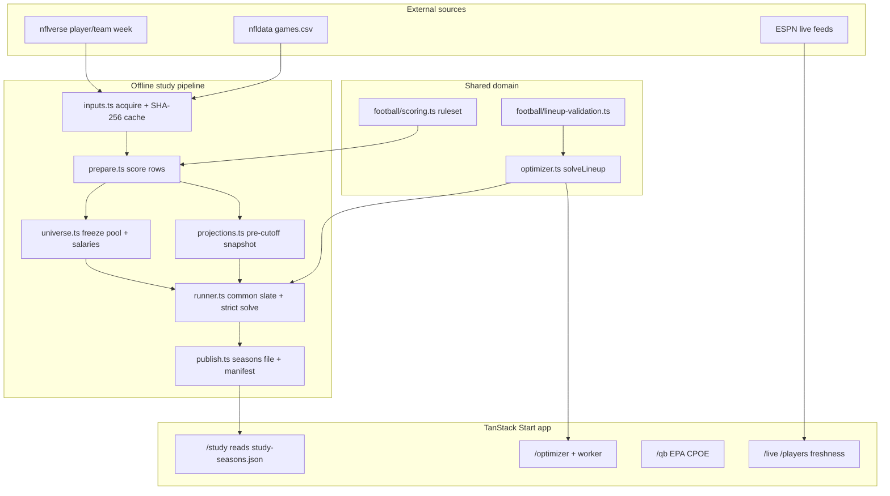

# Design notebook (interview-facing)

**Audience:** you, walking an interviewer through Gridiron Lab in 60 seconds or 5 minutes.  
**Not this file:** the long build diary in [`IMPLEMENTATION_PROGRESS.md`](IMPLEMENTATION_PROGRESS.md), or the attribution archaeology in [`study/REGENERATION_REPORT.md`](study/REGENERATION_REPORT.md). Open those only if someone asks "how did you get here?"

**Core claim:** `/study` is the product. The labs are instrumentation around a reproducible 2023–2025 lineup evaluation with strict causality, a proven salary-cap solver, and published numbers pinned by tests.

---

## 60-second talk track

> I built an NFL fantasy stats lab where the main result is a multi-season lineup study, not a dashboard. For each of 2023–2025 I freeze a 114-player pool and synthetic DraftKings-style salaries from the *prior* season only, project with strictly pre-week history, then require an exact dynamic-programming solver to prove the best $50k lineup—or that week is dropped for every method. Scoring uses a versioned PPR+DST ruleset. Against greedy-by-projection the exact solver gains about **+1.4 points/week** pooled, but the bootstrap range includes zero; against points-per-dollar greedy it wins by ~22. I keep a look-ahead "shipped slate" only as a disclosed comparison, and the README's "What failed" section documents real bugs I found and fixed (broken DP, DST double-counting, opponent-adjust population mismatch). Everything that appears as a study number in the README is recomputed in CI from committed artifacts.

**Open in the browser:** `/study`. **Open in the repo:** `README.md` Result + What failed, then this notebook.

---

## 5-minute talk track

1. **Problem.** Cap-constrained lineup selection looks like "optimize projections," but most hobby projects leak future information, soft-fail the solver, or publish numbers that can't be regenerated. I wanted a study I could defend under interview scrutiny.
2. **Design split.** Offline pipeline (`scripts/lib/study/*`) owns inputs → universe → causal projections → strict solves → sealed run artifacts → publish. Online app (`src/lib`, routes, worker) owns exploration: QB EPA/CPOE, interactive optimizer, live feeds. Same `solveLineup` in both paths.
3. **Leakage control.** Projection cutoff is "rows strictly before week *w*." Opponents come from the *schedule*, never postgame rows. Universes are either `synthetic-prior-season@1` (clean) or the shipped `fantasy.json` (look-ahead, labelled). Roles are `development` / `retrospective` / `holdout`—2025 is retrospective, not a holdout.
4. **Solver contract.** `solveLineup` runs exactly one method with no silent fallback. Study weeks require `exact-dp` + `optimality: "proven"`. The interactive page may fall back to hill-climb for QB stacks, but it labels heuristic and records why.
5. **Honesty as a feature.** First DP sometimes returned nothing and hill-climb was mislabelled exact. Opponent-adjust v1 compared different populations (`opp@1` → `opp@2`). DST scoring double-counted XPs. Those are in README "What failed," not buried.
6. **Reproducibility.** Content-addressed `.study-cache/`, pinned `docs/study/input-manifest.json`, `--offline --pin-inputs`, run ids hashed from config+inputs+policies, `docs-agreement.test.ts` fails if README numbers drift.
7. **What I'd say next.** Weak forecast (trailing mean), synthetic salaries miss rookies, 51 weeks can't separate exact vs greedy, inactive≈0 is ambiguous in nflverse. Cap-optimal on a bad projection is still a bad lineup.

---

## Architecture (layers)



### Why each layer exists (and the tradeoff)

| Layer | Why it exists | Tradeoff |
|---|---|---|
| **inputs / hash cache** | Interviewers ask "can you regenerate?" Pins + offline mode answer with bytes, not vibes. | Cache is gitignored; collaborators must fetch once or use the manifest. |
| **prepare + scoring** | One versioned ruleset (`gridiron-lab-ppr-dst@1`); providers normalize columns first. Missing stats stay missing—never filled with zeros. | Not exact DraftKings; DST points-allowed = opponent's final score (including D/ST scores). |
| **universe** | Separates *who is eligible and at what salary* from *how you project*. Clean pools use prior season only; legacy slate stays for attribution. | Synthetic salaries ≠ market prices; rookies/offseason moves absent. |
| **projections** | Pure functions of a pre-cutoff snapshot so every method sees the same information set. Method defs are versioned (`opp@2`, `ewma@1`, …). | Methods are simple (trail, EWMA, shrink, …)—deliberately explainable, not a black-box ML stack. |
| **runner** | One common slate per week; every model must solve or the week is excluded for all; summaries from week records + week-level bootstrap. | Strictness drops weeks under incomplete actuals; small *n* → wide intervals. |
| **publish** | Page never hand-edits numbers; publish verifies artifact hashes and refuses mixed configs / attribution-only scoring. | Two-step workflow (run → publish) before README/CI agree. |
| **optimizer + validation** | Exact DP for DK-like roster under salary; heuristics labelled; stack is a separate concern. | Exact DP does not encode QB stack; UI may hill-climb and must say so. |
| **worker protocol** | Keeps DP off the main thread; pure `handleWorkerRequest` so Node tests = browser path. | Extra protocol validation; cancel = terminate worker. |
| **routes / labs** | Teachability: interactive optimizer and QB lab make the study tangible. | Large route files; some product surface (auth/db) is adjacent to the DS story. |

---

## Data flow (one study week)

```mermaid
sequenceDiagram
  participant Cache as study-cache SHA-256
  participant Prep as prepare
  participant Snap as snapshotBefore(w)
  participant Feat as buildFeatures
  participant Proj as project(model)
  participant DP as solveLineup exact-dp
  participant Seal as sealRun + publish

  Cache->>Prep: verified player/team/game rows
  Prep->>Snap: only rows with week < w
  Note over Snap: scores stripped from week ≥ w games
  Snap->>Feat: position prior + opp allowed (same population)
  loop each model on shared slate
    Feat->>Proj: subject + snapshot
    Proj->>DP: salary + proj pool
    DP-->>Seal: proven lineup or week excluded
  end
  Seal->>Seal: common weeks only; bootstrap over weeks
```

**Interview soundbite:** "The slate is shared; the projection and the solver method vary; a failure anywhere invalidates the week for the comparison set."

---

## Rubric checklist (mapped to this repo)

| Practice | Meets? | Where |
|---|---|---|
| **Reproducibility** | Yes | `npm run study:build`, `docs/study/input-manifest.json`, `--offline --pin-inputs`, sealed `resultSha256`, `REGENERATION_REPORT.md` |
| **Leakage control** | Yes (clean path) | `projections.snapshotBefore`, schedule opponents, `synthetic-prior-season@1`; shipped slate look-ahead **disclosed** and not in the clean pool |
| **Validation / data integrity** | Strong | Scoring missing≠0; inactive vs missing status; publish config equality checks; CSV required columns |
| **Separation of concerns** | Strong | Pipeline vs domain vs UI; solver API shared; study page reads published JSON only |
| **Testability** | Strong | `tests/domain/*` (solver oracle, projections, runner, publish); `docs-agreement.test.ts` pins README; `test:ui` + Playwright e2e |
| **Observability / honesty** | Strong | Proven vs heuristic labels; feed freshness status; README What failed; exclusion reasons on weeks |
| **Uncertainty communication** | Good | Percentile bootstrap over **weeks** (not players); explicitly "descriptive, not a significance test" |
| **Interview explainability** | Improved by this doc | Still: mega-routes and long `IMPLEMENTATION_PROGRESS` are chronical, not a pitch—use this notebook first |
| **Miss: true holdout** | Gap | 2025 is retrospective; no sealed future season yet. Say so. |
| **Miss: market salaries** | Gap | Synthetic bands from prior PPG—fine for method comparison, not for DFS edge claims. |
| **Miss: stack in exact DP** | Gap | Documented; UI fallback labelled heuristic. |

---

## Files and commands to open in an interview

### Narrative / results
- `README.md` — Result tables + What failed (lead with this)
- `docs/DESIGN_NOTEBOOK.md` — this file
- `docs/study/REGENERATION_REPORT.md` — only if asked how numbers moved after bugfixes
- `docs/perf/optimizer-worker.md` — only if asked about main-thread / worker tradeoffs

### Pipeline (offline)
- `scripts/lib/study/runner.ts` — policies + week loop + strict solver
- `scripts/lib/study/projections.ts` — cutoff snapshot + methods
- `scripts/lib/study/universe.ts` — synthetic vs legacy
- `scripts/lib/study/models.ts` — presets, `opp@2`, EWMA sweep labelling
- `scripts/lib/study/inputs.ts` — content-addressed acquire
- `scripts/lib/study/publish.ts` — seasons file + manifest

### Domain (shared)
- `src/lib/optimizer.ts` — exact DP + heuristics contract
- `src/lib/football/scoring.ts` — versioned ruleset
- `src/lib/football/lineup-validation.ts` — input/roster checks
- `src/lib/lineup/worker-protocol.ts` + `src/workers/optimizer.worker.ts`

### App surface
- `src/routes/study.tsx` — published study UI
- `src/routes/optimizer.tsx` — interactive solve (large; skim with `use-lineup-solver.ts`)

### Proof
- `tests/domain/docs-agreement.test.ts`
- `tests/domain/optimizer-oracle.test.ts` / `optimizer.test.ts`
- `tests/domain/study-*.test.ts`

### Commands
```bash
npm run typecheck
npm run test:domain          # solver + study + docs agreement
npm run study:build -- --help
npm run study:build -- --offline --pin-inputs docs/study/input-manifest.json ...
npm run test:e2e             # after build + playwright chromium
```

---

## Prioritized review (resume / interview readiness)

### Must-fix (for the pitch)
1. **Missing short design notebook** — addressed by this file; README should link it.
2. **Lead with failures, not just wins** — already in README; practice the oral version (see below).
3. **Don't claim holdout or DFS edge** — roles and synthetic salaries are correct in docs; keep language tight in interviews.

### Should-improve (follow-up coding PR)
1. **Split mega-routes** (`study.tsx` / `optimizer.tsx` / `qb.tsx`) into presentational sections + hooks so you can screen-share without scrolling a 30–40KB file.
2. **Thin "resume path" in CONTRIBUTING or README** — one "interview walkthrough" section pointing here (partially done via README link).
3. **Exact DP + stack** — either model stack in DP (harder) or keep heuristic but add a one-line UI callout on `/study` that study runs never use stack fallback (already true via strict runner).

### Nice-to-have
1. Collapse or archive older sections of `IMPLEMENTATION_PROGRESS.md` behind a "history" heading so reviewers don't mistake the diary for the architecture.
2. Optional diagram in `/guide` linking study concepts to UI terms (proven, look-ahead, inactive).
3. Record a 60s Loom of `/study` for applications that allow media.

---

## Practice lines (from README "What failed")

Use these almost verbatim—they signal senior judgment:

- **Synthetic salaries:** "Pools and prices are frozen from the prior season. That removes salary-API noise so methods are comparable, but it misses rookies and cuts. I would never pitch this as a live DFS edge."
- **Shipped slate look-ahead:** "The original 114-player file was built from full-season 2025 stats. Only 66 overlap the clean pool. It stays as a comparison row, never as the historical claim."
- **Broken first DP:** "The first exact solver sometimes returned nothing; hill-climb filled in while results were still labelled exact. I fixed the DP, made the study strict—no substitute method—and documented that the old page was wrong."
- **Opponent-adjust bug:** "Version 1 divided an all-player opponent mean by the *pool's* position mean—different populations—so skill players sat on the 0.7 clamp. `opp@2` uses one population; the published claim softened accordingly."
- **Inactive = 0:** "No stat row in a final game scores zero in the lineup, but nflverse also omits active zeros. Trailing-mean lineups used 49 such slots over 51 weeks."
- **Headline humility:** "Exact beats greedy by +1.4/week pooled, but the range includes zero. Cap-optimal on a weak projection is still a weak lineup. The interesting failure mode is selection: player-level bias ≈ 0 while lineup projection overshot every week."

---

## Glossary (quick)

| Term | Meaning here |
|---|---|
| **Proven** | Exact DP found the optimal roster under stated constraints |
| **Heuristic** | Greedy / hill-climb; not a proof |
| **Look-ahead** | Universe or features used information from after the prediction cutoff |
| **Common weeks** | Weeks where every compared model produced a complete lineup actual |
| **Development / retrospective** | Tuned-on vs examined-before; neither is a sealed holdout |
