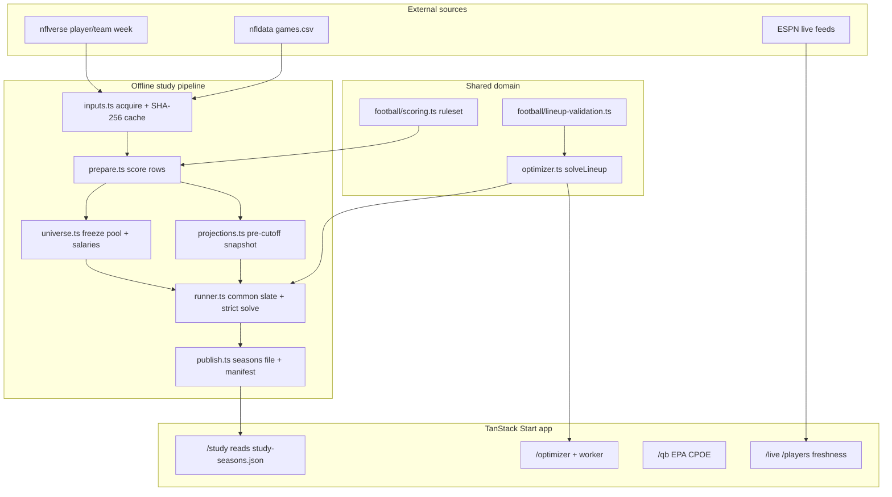

# Design notebook (interview-facing)

**Audience:** you, explaining Gridiron Lab in 60 seconds or 5 minutes.  
**Not this file:** the long build diary in [`IMPLEMENTATION_PROGRESS.md`](IMPLEMENTATION_PROGRESS.md), or the deep change log in [`study/REGENERATION_REPORT.md`](study/REGENERATION_REPORT.md).

**Rule:** keep the story simple. Only use ideas you can explain out loud without buzzwords. If you can’t defend it in one sentence, don’t put it on a resume.

**One-line resume angle:** Fair multi-season backtest of $50k fantasy lineups on NFL data — no future-data cheating, exact best lineup or the week is dropped, scores regenerated in CI, failures written up honestly.

**Core claim:** `/study` is the result. The website helps you explore; the science is the study rules + the numbers + the failure notes. Lead with those, not UI.

---

## 60-second talk track

> I built a fair backtest for fantasy lineups, not a tip sheet. For 2023–2025 I lock a 114-player pool and fake salaries from the *prior* season only, project using only earlier weeks, then require an exact optimizer to find the true best $50k lineup—or I drop that week for every method. Exact vs “pick highest projections” is about **+1.4 points/week**, but the uncertainty range includes zero, so I don’t oversell it. Exact beats “points per dollar” by a lot (~22). One old “shipped” slate used future info on purpose — I keep it only as a labelled comparison. README “What failed” lists real bugs I fixed. CI rebuilds the README numbers from saved study files.

**Ideas worth saying (plain English):** don’t peek at the future · same weeks for every method · exact best or drop the week · save inputs so anyone can rebuild · admit failures.

**Open first:** `README.md` Result + What failed, then this notebook. **Optional demo:** `/study`.

---

## 5-minute talk track

1. **Problem.** Can you compare lineup methods fairly? Many projects peek at future stats, replace a failed “exact” solve with a guess, or paste numbers by hand. I wanted a study I can defend.
2. **Where the science lives.** The study scripts (`scripts/lib/study/*`) do the real work: pin data → build pools → project → solve → save results → publish into the README. The website reuses the same solver for demos. Spend interview time on the study, not the UI.
3. **No future peeking.** For week *w*, projections only see weeks before *w*. Opponents come from the schedule, not the final box score. Clean pools use last season only. The old shipped slate used future info — labelled, not clean history. 2025 was looked at before, so I call it retrospective, not a secret holdout.
4. **Exact means exact.** In the study, the optimizer must prove the best lineup or the week is dropped for everyone. The interactive page can use a faster guess for some constraints, but it must say so.
5. **I publish my mistakes.** Broken first solver, DST scoring bug, opponent-adjust comparing the wrong groups — all in README “What failed.”
6. **Rebuildable numbers.** Inputs are hashed and pinned; CI fails if README study numbers don’t match the saved runs.
7. **What I don’t claim.** Trailing mean isn’t a great forecast. Fake salaries miss rookies. 51 weeks isn’t enough to crown exact over simple greedy. Best salary-cap lineup on a weak projection is still weak.

---

## How the pieces fit



### Why each layer exists (and the tradeoff)

| Layer | Why it exists | Tradeoff |
|---|---|---|
| **inputs / hash cache** | Interviewers ask "can you regenerate?" Pins + offline mode answer with bytes, not vibes. | Cache is gitignored; collaborators must fetch once or use the manifest. |
| **prepare + scoring** | One versioned ruleset (`gridiron-lab-ppr-dst@1`); providers normalize columns first. Missing stats stay missing—never filled with zeros. | Not exact DraftKings; DST points-allowed = opponent's final score (including D/ST scores). |
| **universe** | Separates *who is eligible and at what salary* from *how you project*. Clean pools use prior season only; legacy slate stays for attribution. | Synthetic salaries ≠ market prices; rookies/offseason moves absent. |
| **projections** | Only use data from before the week, so every method sees the same information. Method defs are versioned (`opp@2`, `ewma@1`, …). | Methods are simple (trail, EWMA, shrink, …)—deliberately explainable, not a black-box ML stack. |
| **runner** | One common slate per week; every model must solve or the week is excluded for all; summaries from week records + week-level bootstrap. | Strictness drops weeks under incomplete actuals; small *n* → wide intervals. |
| **publish** | Page never hand-edits numbers; publish verifies artifact hashes and refuses mixed configs / attribution-only scoring. | Two-step workflow (run → publish) before README/CI agree. |
| **optimizer + validation** | Exact solver for DK-like roster under salary; guesses labelled; stack is a separate concern. | Exact DP does not encode QB stack; UI may hill-climb and must say so. |
| **worker protocol** | Keeps the heavy solve off the main thread; pure `handleWorkerRequest` so Node tests = browser path. | Extra protocol validation; cancel = terminate worker. |
| **routes / labs** | Teachability: interactive optimizer and QB lab make the study tangible. Study / optimizer / QB page sections live in `src/components/{study,optimizer,qb}/`; routes stay thin shells. | `qb.tsx` still owns URL/pin/scatter state (`QbLab`); some product surface (auth/db) is adjacent to the DS story. |

### App surface map (optional demo)

Only if they ask to click around. Prefer the study pipeline files below. Component folders (post-split):

- `src/components/study/` — DidItHelp, TooOptimistic, BetterGuesses, HotQbs, WhatWentWrong, …
- `src/components/optimizer/` — SolvePanel, LineupResult, PlayerRows, BacktestPanel, …
- `src/components/qb/` — WeekBars, QbDot, QbDotTip, Field

Routes (`src/routes/study.tsx`, `optimizer.tsx`, `qb.tsx`) compose those pieces. Solver contract (`useLineupSolver` / proven-vs-heuristic labelling) is unchanged.

---

## Data flow (one study week)

```mermaid
sequenceDiagram
  participant Cache as study-cache SHA-256
  participant Prep as prepare
  participant Snap as snapshotBefore(w)
  participant Feat as buildFeatures
  participant Proj as project(model)
  participant DP as solveLineup exact-dp
  participant Seal as sealRun + publish

  Cache->>Prep: verified player/team/game rows
  Prep->>Snap: only rows with week < w
  Note over Snap: scores stripped from week ≥ w games
  Snap->>Feat: position prior + opp allowed (same population)
  loop each model on shared slate
    Feat->>Proj: subject + snapshot
    Proj->>DP: salary + proj pool
    DP-->>Seal: proven lineup or week excluded
  end
  Seal->>Seal: common weeks only; bootstrap over weeks
```

**Interview soundbite:** "The slate is shared; the projection and the solver method vary; a failure anywhere invalidates the week for the comparison set."

---

## Rubric checklist (mapped to this repo)

| Practice | Meets? | Where |
|---|---|---|
| **Reproducibility** | Yes | `npm run study:build`, `docs/study/input-manifest.json`, `--offline --pin-inputs`, sealed `resultSha256`, `REGENERATION_REPORT.md` |
| **No future peeking** | Yes (clean path) | `projections.snapshotBefore`, schedule opponents, `synthetic-prior-season@1`; shipped slate used future info — **labelled** and not in the clean pool |
| **Validation / data integrity** | Strong | Scoring missing≠0; inactive vs missing status; publish config equality checks; CSV required columns |
| **Separation of concerns** | Strong | Pipeline vs domain vs UI; solver API shared; study page reads published JSON only |
| **Testability** | Strong | `tests/domain/*` (solver oracle, projections, runner, publish); `docs-agreement.test.ts` pins README; `test:ui` + Playwright e2e |
| **Observability / honesty** | Strong | Proven vs heuristic labels; feed freshness status; README What failed; exclusion reasons on weeks |
| **Uncertainty / honesty about noise** | Good | Percentile bands over **weeks** (not players); labelled as descriptive, not a formal significance test |
| **Interview explainability** | Improved by this doc | Still: mega-routes and long `IMPLEMENTATION_PROGRESS` are chronical, not a pitch—use this notebook first |
| **Miss: sealed future season** | Gap | 2025 was already looked at; not a secret holdout. Say so. |
| **Miss: market salaries** | Gap | Synthetic bands from prior PPG—fine for method comparison, not for DFS edge claims. |
| **Miss: stack constraint in exact solver** | Gap | Documented; UI fallback labelled as a guess, not a proof. |

---

## Files and commands to open in an interview

### Narrative / results
- `README.md` — Result tables + What failed (lead with this)
- `docs/DESIGN_NOTEBOOK.md` — this file
- `docs/study/REGENERATION_REPORT.md` — only if asked how numbers moved after bugfixes
- `docs/perf/optimizer-worker.md` — only if asked about main-thread / worker tradeoffs

### Pipeline (offline)
- `scripts/lib/study/runner.ts` — policies + week loop + strict solver
- `scripts/lib/study/projections.ts` — cutoff snapshot + methods
- `scripts/lib/study/universe.ts` — synthetic vs legacy
- `scripts/lib/study/models.ts` — presets, `opp@2`, EWMA sweep labelling
- `scripts/lib/study/inputs.ts` — download + SHA-256 pin so reruns use the same files
- `scripts/lib/study/publish.ts` — seasons file + manifest

### Domain (shared)
- `src/lib/optimizer.ts` — exact solver + labelled guesses
- `src/lib/football/scoring.ts` — versioned ruleset
- `src/lib/football/lineup-validation.ts` — input/roster checks
- `src/lib/lineup/worker-protocol.ts` + `src/workers/optimizer.worker.ts`

### App surface
- `src/routes/study.tsx` — published study UI
- `src/routes/optimizer.tsx` — interactive solve (large; skim with `use-lineup-solver.ts`)

### Proof
- `tests/domain/docs-agreement.test.ts`
- `tests/domain/optimizer-oracle.test.ts` / `optimizer.test.ts`
- `tests/domain/study-*.test.ts`

### Commands
```bash
npm run typecheck
npm run test:domain          # solver + study + docs agreement
npm run study:build -- --help
npm run study:build -- --offline --pin-inputs docs/study/input-manifest.json ...
npm run test:e2e             # after build + playwright chromium
```

---

## Prioritized review (resume / interview readiness)

### Must-fix (for the pitch)
1. **Missing short design notebook** — addressed by this file; README should link it.
2. **Lead with failures, not just wins** — already in README; practice the oral version (see below).
3. **Don't claim holdout or DFS edge** — roles and synthetic salaries are correct in docs; keep language tight in interviews.

### Should-improve (follow-up — data science, not UI chrome)
1. **Mega-route split is done.** Further `QbLab` extraction is optional demo hygiene — skip unless a live screen-share needs it.
2. **If claiming market edge later:** real salaries and/or a sealed holdout season. Until then, keep calling 2025 retrospective and salaries synthetic.
3. **Keep the diary demoted:** `IMPLEMENTATION_PROGRESS.md` is history; this notebook + README Result stay the resume path.

### Nice-to-have
1. Collapse older `IMPLEMENTATION_PROGRESS` sections under History so reviewers don't mistake the diary for the architecture.
2. A one-page PDF "study abstract" for applications that want a paper-like artifact (same claims as the 60s track).
3. Optional short recording of `/study` only if an application asks for media — not required for the DS claim.

---

## Practice lines (from README "What failed")

Use these almost verbatim—they signal senior judgment:

- **Synthetic salaries:** "Pools and prices are frozen from the prior season. That removes salary-API noise so methods are comparable, but it misses rookies and cuts. I would never pitch this as a live DFS edge."
- **Shipped slate look-ahead:** "The original 114-player file was built from full-season 2025 stats. Only 66 overlap the clean pool. It stays as a comparison row, never as the historical claim."
- **Broken first DP:** "The first exact solver sometimes returned nothing; hill-climb filled in while results were still labelled exact. I fixed the DP, made the study strict—no substitute method—and documented that the old page was wrong."
- **Opponent-adjust bug:** "Version 1 divided an all-player opponent mean by the *pool's* position mean—different populations—so skill players sat on the 0.7 clamp. `opp@2` uses one population; the published claim softened accordingly."
- **Inactive = 0:** "No stat row in a final game scores zero in the lineup, but nflverse also omits active zeros. Trailing-mean lineups used 49 such slots over 51 weeks."
- **Headline humility:** "Exact beats greedy by +1.4/week pooled, but the range includes zero. Cap-optimal on a weak projection is still a weak lineup. The interesting failure mode is selection: player-level bias ≈ 0 while lineup projection overshot every week."

---


## Resume framing (copy-paste)

**Title-ish:** Fair multi-season backtest of $50k fantasy lineups on NFL data (TypeScript).

**Bullets:**
- Built a multi-season backtest with no future-data cheating: prior-season player pools/salaries, projections from earlier weeks only, same weeks kept for every method.
- Compared an exact salary-cap optimizer to simple greedy baselines; reported when the gain was unclear (uncertainty range includes zero) instead of overselling.
- Pinned study inputs and made CI rebuild the README numbers from those runs.
- Wrote up and fixed real evaluation bugs (broken “exact” solver, scoring mistake, opponent adjustment using the wrong group, a look-ahead slate kept only as a comparison).

**What not to claim:** Live DraftKings edge; that 2025 is a sealed holdout; that a simple average is a strong forecast.

## Glossary (quick)

| Term | Meaning here |
|---|---|
| **Proven** | Exact solver found the true best roster under the stated rules |
| **Heuristic** | Greedy / hill-climb; not a proof |
| **Look-ahead** | Universe or features used information from after the prediction cutoff |
| **Common weeks** | Weeks where every compared model produced a complete lineup actual |
| **Development / retrospective** | Tuned-on vs looked-at-before; neither is a secret future holdout |
